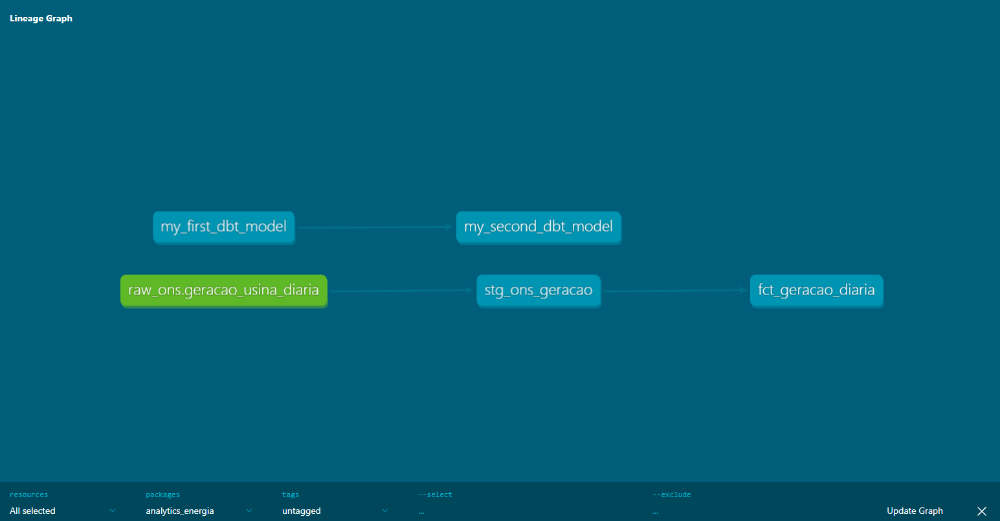

# Energy Analytics Pipeline - ONS

Este projeto apresenta a implementação de um pipeline de dados completo (ELT) utilizando dados de geração de energia do Operador Nacional do Sistema Elétrico (ONS). O objetivo é demonstrar a aplicação de boas práticas de engenharia de dados e modelagem analítica para o setor elétrico.

## Tecnologias e Ferramentas
* **Python**: Automação da extração via dados abertos e carga inicial.
* **Google BigQuery**: Data Warehouse utilizado para armazenamento e processamento escalável em nuvem.
* **dbt (data build tool)**: Framework para transformação, controle de linhagem, testes de qualidade e documentação.

## Arquitetura do Projeto
O fluxo de dados foi estruturado seguindo os princípios de ELT moderno:
1. **Ingestão**: Script Python configurado para extrair dados brutos e carregá-los na camada `raw` do BigQuery, garantindo a preservação da fonte original.
2. **Transformação (Staging)**: Modelagem inicial para padronização de tipos de dados, limpeza de strings e renomeação de campos técnicos para facilitar o entendimento.
3. **Modelagem (Analytics/Mart)**: Criação de tabelas fato consolidadas por subsistema e usina, otimizadas para consumo direto em ferramentas de Business Intelligence.

## Linhagem de Dados (Lineage)
A documentação do projeto inclui o grafo de linhagem gerado pelo dbt, que permite a rastreabilidade total do dado, desde a sua origem bruta até o modelo final de negócio.

## Instruções de Execução
1. Configuração das credenciais do Google Cloud no arquivo `profiles.yml`.
2. Execução do script de ingestão: `python scripts/ingest_ons.py`.
3. Execução das transformações e testes no dbt: `dbt run`.

---

# Energy Analytics Pipeline - ONS

This project implements a complete data pipeline (ELT) utilizing energy generation data from the Brazilian National Electric System Operator (ONS). The goal is to demonstrate the application of data engineering best practices and analytical modeling within the energy sector.

## Technology Stack
* **Python**: Automated data extraction and initial loading.
* **Google BigQuery**: Data Warehouse for scalable storage and cloud processing.
* **dbt (data build tool)**: Framework for data transformation, lineage control, quality testing, and documentation.

## Project Architecture
The data flow follows modern ELT principles:
1. **Ingestion**: Python script designed to extract raw data and load it into BigQuery's `raw` layer, ensuring source data integrity.
2. **Transformation (Staging)**: Initial modeling to standardize data types, clean strings, and rename technical fields for better readability.
3. **Modeling (Analytics/Mart)**: Creation of consolidated fact tables by subsystem and power plant, optimized for Business Intelligence consumption.

## Data Lineage
The project documentation includes a dbt-generated lineage graph, providing full data traceability from the raw source to the final business model.

## Execution Instructions
1. Configure Google Cloud credentials in the `profiles.yml` file.
2. Run the ingestion script: `python scripts/ingest_ons.py`.
3. Execute dbt transformations and tests: `dbt run`.

---

# Energy Analytics Pipeline - ONS

Este proyecto presenta la implementación de un pipeline de datos completo (ELT) utilizando datos de generación de energía del Operador Nacional del Sistema Eléctrico (ONS) de Brasil. El objetivo es demostrar la aplicación de buenas prácticas de ingeniería de datos y modelado analítico para el sector energético.

## Tecnologías y Herramientas
* **Python**: Automatización de la extracción a través de datos abiertos y carga inicial.
* **Google BigQuery**: Data Warehouse utilizado para almacenamiento y procesamiento escalable en la nube.
* **dbt (data build tool)**: Framework para transformación, control de linaje, pruebas de calidad y documentación.

## Arquitectura del Proyecto
El flujo de datos se estructuró siguiendo los principios de ELT moderno:
1. **Ingestión**: Script Python configurado para extraer datos brutos y cargarlos en la capa `raw` de BigQuery, garantizando la preservación de la fuente original.
2. **Transformación (Staging)**: Modelado inicial para la estandarización de tipos de datos, limpieza de cadenas (strings) y renombre de campos técnicos para facilitar la comprensión.
3. **Modelado (Analytics/Mart)**: Creación de tablas de hechos consolidadas por subsistema y planta generadora, optimizadas para el consumo directo en herramientas de Business Intelligence.

## Linaje de Datos (Lineage)
La documentación del proyecto incluye el gráfico de linaje generado por dbt, que permite la trazabilidad total del dato, desde su origen bruto hasta el modelo final de negocio.

## Instrucciones de Ejecución
1. Configuración de las credenciales de Google Cloud en el archivo `profiles.yml`.
2. Ejecución del script de ingestión: `python scripts/ingest_ons.py`.
3. Ejecución de las transformaciones y pruebas en dbt: `dbt run`.